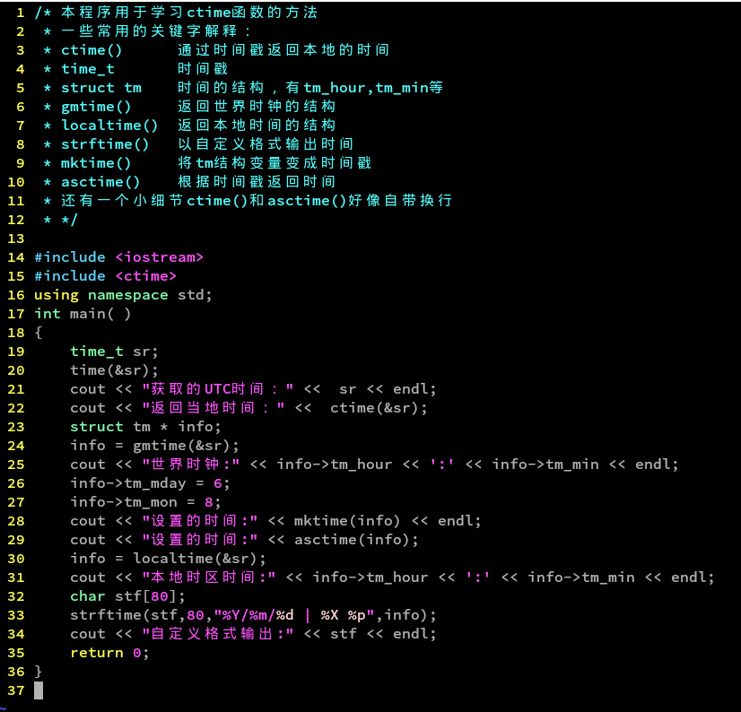
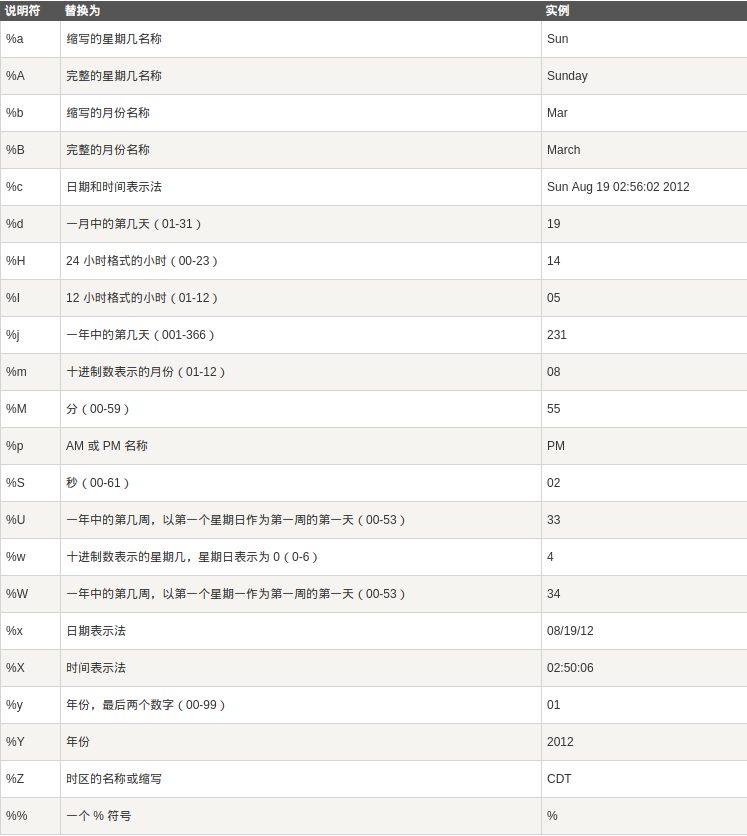

在写小程序时接触到的一个C标准函数库
<!--more-->

# 简介

表示时间的数据类型



# tm 结构  

```
//需要包含<ctime>头文件
struct tm{
    int tm_sec;     //秒
    int tm_min;     //分
    int tm_hour;    //时
    int tm_mday;    //每个月的第几天
    int tm_mon;     //月份
    int tm_year;    //1900年到现在的年份
    int tm_wday;    //表示星期几，周日开始
    int tm_yday;    //一年中的第几天
    int tm_isdst;   //夏令时标识
};

```

# time_t  

实质上就是long数据类型的别名，另外clock_t也是一样。

# time  

得到从1970年1月1日 0：00到现在的秒数

函数原型: time_t time(time_t *timer)

# asctime() 

将tm结构的日期时间返回成一个字符串。字符串格式：星期,月,日,小时：分：秒,年

函数原型: char* asctime(struct tm * ptr)  

# ctime  

将time_t类型时间戳返回成一个字符串。格式与上面相同

函数原型: char *ctime(const time_t *time)

# strftime()  

将tm结构转换为自定义格式的字符串。



函数原型：size_t strftime(char* s, size_t n, const char* format, const struct tm* tptr)

# localtime()  

用本地时区来表示时间  

函数原型：struct tm* localtime(const time_t* timer)

# gmtime()  

标准的UTC时间，也就是世界时钟  

函数原型：struct tm* gmtime(const time_t* timer)  

# mktime()  

将tm结构转换为time_t类型  

函数原型：time_t mktime(struct tm* ptm)  


