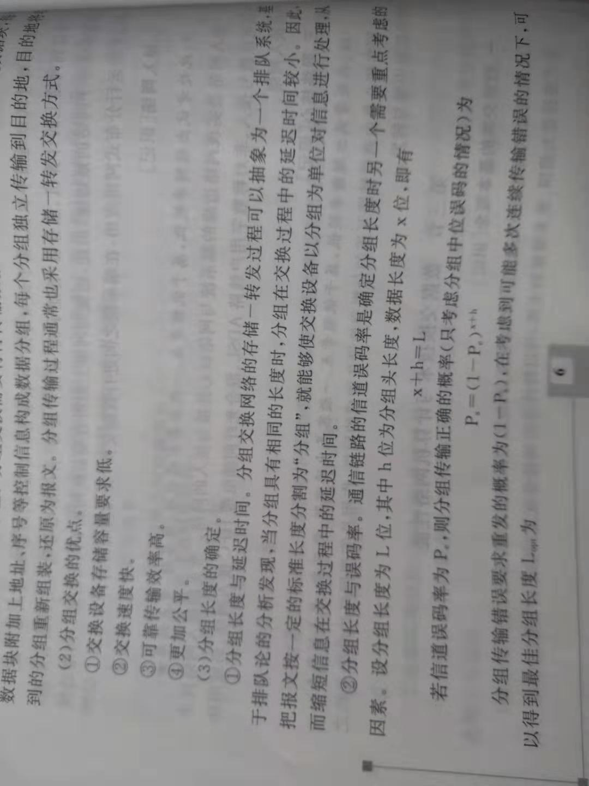
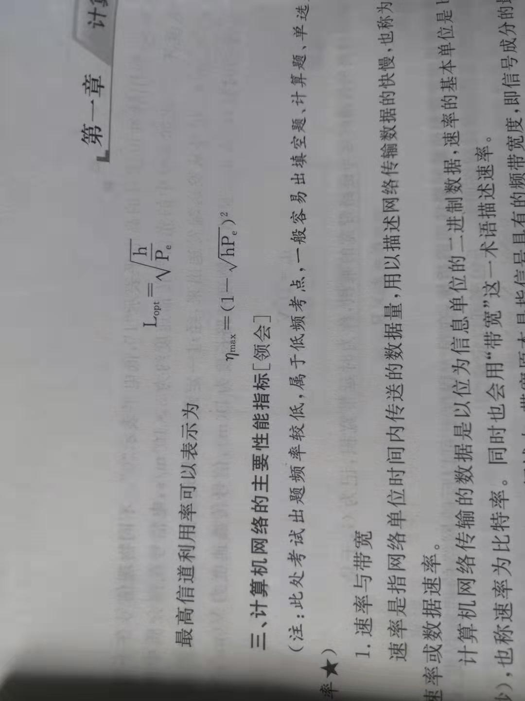
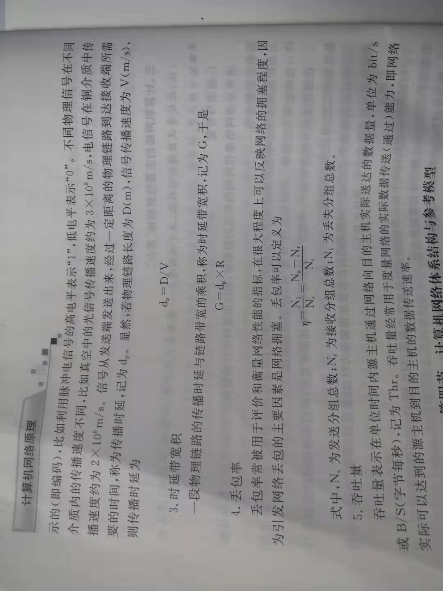

11111
<!--more-->

# 网络基本原理

1. 为什么需要计算机网络?  

因为我们计算机之间需要进行快速、大量的信息交换。因此，在技术范畴来看，计算机网络是计算机技术与通信技术相互融合的产物。

2. 简短、概括性的计算机网络定义  

计算机网络是互连的、自治的计算机的集合。

自治  是指互联的计算机系统是各自独立的

互连  是指利用通信链路链接相互独立的计算机系统。

3. 最大、应用最广泛的计算机网络

Internet是由很多网络互联而构成的全球性网络;
nternet是由很多网络互联而构成的全球性网络nternet是由很多网络互联而构成的全球性网络
计算机网络设备通过有线或者无线方式连接服务提供商(ISP)网络，进而接入Internet。

连接到Internet上的计算机设备都被称为主机或者端系统。  

Internet的网络连接：小型家用网络连接本地ISP或者区域ISP网络。然后再与规模更大的国家级网络互连，国家ISP再互连其他国家ISP或者全球性ISP，实现全球所有ISP网络的互连。

4. ISP网络  

由许多有线或者无线通信链路互连分组交换设备构成。

分组交换设备可以实现数据分组的接受与转发，是构成Internet的重要基础，存在多种形式，最典型的是交换机和路由器。

#  网络协议  

计算机网络中的实体在进行数据交换的过程中必须遵守的一些规则或约定。

概括地说，协议约定了实体之间交换的信息类型、信息各部分的含义、信息交换顺序以及收到特定信息或出现异常时应采取的行为。

协议三要素

- 语法：实体之间交换信息的格式与结构  

- 语义：实体之间交换的信息除了需要传输的数据外，通常还包括其他控制信息;语义就是定义了需要发送哪些控制信息，这些控制信息的含义，以及针对不同的控制信息，接受端如何响应。

- 时序：又称为同步，定义了实体之间交换信息的顺序及如何匹配或适应彼此的速度。

# 计算机网络的功能  

通过信息交换，计算机网络可实现资源共享这一核心功能。  

1. 硬件资源共享  

一台主机可以共享另一台主机上的硬件资源，包括CPU、存储资源、打印机、扫描仪I/O设备等 

实例：云计算机和云存储可以提供硬件计算资源和存储资源的共享。

2. 软件资源共享 

网络上的主机可以远程访问、使用服务器计算机上运行的各类大型软件。  

SaaS：通过互联网提供软件服务。

3. 信息资源共享  

即我们在互联网上查看新闻，资料。

计算机网络支持的信息交换就是典型的信息共享。  

# 计算机网络的分类 

## 按覆盖范围分类

1. 个域网(PAN)  

由个人设备通过无线通信技术构成小范围的网络，实现个人设备之间的数据传输。

覆盖范围1-10 m

2. 局域网（LAN）  

通常使用在校园，办公楼等局部区域，采用高速有线或无线链路连接主机，实现局部范围内高速数据传输。

覆盖范围1-10 km

3. 城域网(MAN)  

覆盖一个城市的网络。

覆盖范围5-50 km  

4. 广域网(WAN)  

跨越更大的地理空间，可以实现异地局域网或局域网的互连。

覆盖范围几十到几千千米  

## 按拓扑(tuo pu)结构分类

什么是网络拓扑？  

网络中的主机、网络设备间的物理连接关系与布局。

1. 星型拓扑结构  

星型拓扑结构网络中包括一个中央节点网络中的主机通过点对点通信链路与中央节点连接。

中央节点通常是集线器、交换机等设备。

多见于局域网、个域网中

优点：易于监控与管理，故障诊断与隔离容易。

缺点：中央节点是网络的瓶颈，一旦故障，全网瘫痪，网络规模受限于中央节点的端口数量。

2. 总线型拓扑结构  

总线型拓扑结构网络采用一条广播信号作为公共传输介质，称为总线，所有结点均与总线连接

在任一节点发送信息，其他节点都会接收到这些信息的信号。

多见于早期的局域网  

优点：结构简单，易于扩展，所需电缆数量少。

缺点：通信范围受限，故障诊断与隔离比较困难，容易产生冲突。

3. 环形拓扑结构  

利用通信链路将所有节点连接成一个闭合的环。

优点：所需电缆长度短，可以使用光纤，易于避免冲突。

缺点：某节点的故障容易导致全局瘫痪，节点的加入或撤出过程比较麻烦，存在等待时间问题。

4. 网状拓扑结构  

通过多条链路与不同的节点直接连接。

多见于广域网、核心网络。

优点：网络可靠性高，一条或多条链路故障时，网络仍然可联通。   

缺点：网络结构复杂，造价成本高，选路协议复杂。

5. 树形拓扑结构  

总线型或是星型的扩展  

很多局域网采用这种结构  

优点：易于扩展，故障隔离容易。

缺点：对根节点的可靠要求性很高，一旦根节点故障，可能导致网络大范围无法通信。

6. 混合拓扑结构  

两种以上的简单拓扑结构混合连接而成的网络。

绝大多数实际网络都属于混合拓扑结构，比如Internet。

优点：易于扩展，可以构建不同规模的网络，并可根据需要优选网络结构。

缺点：网络结构复杂，管理与维护复杂。

## 按交换方式分类  

什么是数据交换？

网络通过彼此互连的结点间数据转接，实现将数据从发送结点送达目的结点的过程和技术。  

可分为电路交换网络、报文交换网络和分组交换网络。  

## 按网络用户属性分类  

1. 公用网  

由国家或企业出资建设，面向公众提供收费或免费的网络。

比如电信企业、Internet等

2. 私有网  

不向公众开放的网络。

比如军用网络铁路专用网络等。

# 计算机网络结构  

## 网络边缘  

连接到网络上的所有端系统构成了网络边缘。  

普通网络用户就是在网络边缘通过网络应用，实现在网络边缘的端系统之间信息交换，因此，可以说网络边缘为网络用户提供了网络应用服务。

## 接入网络  

接入网络实现网络边缘的端系统与网络核心连接与接入的网络。

1. 电话拨号接入  

利用电话网络，模拟数字电路传送到远端。  

最大带宽通常为56kbit/s

2. 非对称用户线路ADSL  

利用现有的电话网络的用户路线接入网络

基于频分多路复用(FDM)技术实现电话语音通信与数字通信共享一条用户路线。

之所以成为“非对称”，是因为ADSL接入网络中，在用户线路实现上行带宽(上传速度)比下行带宽(下载速度)小。

用户线路长度为3～5km内，典型的上行带宽为512kbit/s～1Mbit/s，下行宽带为1~8Mbit/s  

用户线路长度为1.3km以内，上行达到19.2Mbit/s，下行为55Mbit/s。

3. 混合光纤同轴电缆HFC接入网路

利用有线电视网络实现网络接入的技术

上行带宽30.7Mbit/s，下行带宽为42.8Mbit/s。

HFC接入没有ADSL接入速率快，因为ADSL是独享式接入，HFC是利用同轴电缆共享式接入。

4. 局域网  

企业、学校内建设局域网，连接所有需要接入外部网络的主机，然后通过企业网络或学校网的边缘路由器连接网络核心。  

局域网技术是以太网、Wi-Fi等。

5. 移动接入网络  

利用移动通信网络，实现智能手机、移动终端等设备的网络接入。

## 网络核心  

由通信链路互连的分组交换设备构成的网络，作用是实现网络边缘中主机之间的数据中继与转发。

比较典型的分组交换设备是路由器和交换机等。

# 数据交换技术

为了连接更大范围、更多数量的主机，将交换设备互连，构成一个数据中继与转发的中间网络，然后在将主机链接到距离较近的交换设备上，主机之间通过中间网络实现中继和转发。

这个中间网络不需要关心所传的数据内容，而只是为了为这些数据从一个节点到另一个节点直至到达目的提供数据与交换的功能，称之为数据交换网路。

组成交换网路的节点称之为交换节点，交换节点和传输介质的集合为通信子网。

数据交换是实现在大规模网络核心上进行网路传输的技术基础。

## 电路交换  

首先需要中间交换节点为两台主机之间建立一条专用的通信线路，称为电路，然后再利用该电路进行通信，通信结束后在拆除电路。

利用电路交换通信包括建立电路，交换数据，拆除电路三个阶段。

优点是实时性高，时延和时延抖动都较小。

缺点是对于突发性数据传输，通信利用率低，且传输速率单一。

## 报文交换  

发送方把要发送的信息附加上发送/接受主机的地址及其他控制信息，构成一个完整的报文，然后以报文为单位在交换网路的各结点之间以存储-转发的方式传送，直至送达目的主机。  

## 分组交换  

需要将待传输的数据分割成较小的数据快，每个数据块附加上地址、讯号等控制信息构成数据分组，每个分组独立传输到目的地，目的地将收到的分组重新组装，还原为报文。

采用存储-转发交换方式，与报文交换的主要区别在于是否拆分报文。

优点：

1. 交换设备存储容量要求低

2. 交换速度快  

3. 可靠传输速率高  

4. 更加公平  

## 分组长度的确定  
  
1. 分组长度与延迟时间  

分组交换网络的存储-转发过程可以抽象为一个排队系统，基于排队论的分析发现，当分组具有相同的长度时，分组在交换过程中的延迟时间较小。

2. 分组长度与误码率  

通信链路的信道误码率是确定分组长度另外一个需要重点考虑的因素。设分组长度为L位，其中h位为分组头长度，数据长度为x位   x+h=L

若信道误码率为

# 计算机性能的主要性能指标  

1. 速率与带宽  

速率指网络单位内传送的数据量，用以描述网络传输数据的快慢，也称为数据传输速率。

计算机网络以位为传输单位，所以用bit/s表示基本单位。

2. 时延  

数据从网络中的一个结点到达另一个结点的时间。

- 结点处理延迟  

验证是否有差错，如何转发，还有可能修改部分控制信息。  

- 排队时延  

在该分组前有相同链路在进行传输时，分组要在交换节点进行暂时缓存，排队等待输出链路可用。

- 传输时延  

从发送第一位开始，到发送完最后一位的时间。

- 传播时延  

信号从发送端发送出来，经过一定距离的物理链路到达接收端的时间。  

3. 时延带宽积  

一段物理链路的传播时延于链路带宽的乘积  

4. 丢包率  

用于评价和衡量网络性能的指标，在很大程度上可以反映网络的拥塞程度，因为引发网络丢包的主要因素是网络拥塞。  

5. 吞吐量  

表示在单位时间内源主机通过网络向目的主机实际送达的数据量，单位为bit/s或B/s（字节/秒），记为Thr。吞吐量经常用于度量网络的实际数据传送能力，即网络实际可以达到的源主机到目的主机的数据传送速率。

公式图  

# 计算机网络体系结构与参考模型  

## 计算机网络体系结构  

计算机网路经常采用的思路是将复杂的网络通信功能划分为协议分别完成，然后将这些协议按照一定的方式组织起来，实现网络通信所有功能。

最典型的是分层划分，核心思路是上一层的功能建立在下一层的功能基础上，并且在每一层均要遵守协议。

IBM公司1974年提出SNA（系统网络体系结构）

## OSI参考模型  

采用分层结构化技术，一共分为7层。  

协议数据单元 == PDU

1. 物理层  

主要功能是在传输介质上实现无结构比特流传输。另一项主要任务就是规定数据终端设备与数据通信设备之间的相关特性，主要包括机械、电气、功能和规程4方面特性。

无结构是指不关心比特流代表的信息，只关心一合适的信号传送到目的地。

2. 数据链路层  

主要功能实现在相邻节点之间数据可靠而有效的传输。  

另外一项重要功能就是寻址，用来确保每一帧都能准确地传送到正确的接受方。

为了能实现有效的差错控制，采用一种以`帧`为单元的数据快传输方式。要采用帧格式传输，就必须有相应的帧同步技术，即“成帧”（帧同步）功能，包括定义帧的格式、类型、成帧的方法等。  

3. 网络层  

网络层解决的核心问题是如何将分组通过交换网络传送之目的地，因此，主要功能是数据转发与路由。

在交换网络中，信息从源结点出发，经过若干中继结点存储转发后，才能到达目的结点称为从源结点到目的结点的路径。

网络层要对进入交换网络的通信量进行控制，避免通信量过大造成交换网络性能下降。

网络层也具备寻址功能，确保分组可以被正确的传输到目的主机。

4. 传输层  

传输层是第一个端到端的层次，也是一个进程-进程的层次，数据的通信实质是发生在两个主机的进程之间。

主要功能包括复用/分解（分区发送和接受主机上的进程）、端到端的可靠数据传输、连接控制、流量控制和拥塞控制机制等。

5. 会话层  

指用户与用户的连接，通过两台计算机建立、管理和终止通信来完成对话。

主要功能包括在建立会话时核实双方身份是否有权参加会话;确定双方支付通信费用;双方在各种选择功能方面取得一致;在会话建立以后，需要对进程间的对话进行管理和控制。

6. 表示层  

主要用于处理应用实体之间的交换数据的语法，其目的是解决格式和数据表示的差别，从而为应用提供一致的数据格式，使字符、格式等有差异的设备之间相互通信。

表示层还可以实现文本压缩/解压缩、数据加密/解密、字符编码的转换等功能。  

7. 应用层  

提供给用户网络服务，包括文件传送、电子邮件、P2P应用等。为用户提供一个使用网络应用的接口。

- 数据单元(PDU)

物理层称为流或比特流，在数据链路称为帧，在网络层称为分组或包、在传输层称为数据段或报文段，在应用层称为报文等。

- 服务访问点  

相邻层间的服务通过其接口上的服务访问点(SAP)进行的，N层SAP就是N+1层可以访问N层的地方。

每个SAP都有唯一的地址号码  

- 服务原语  

相邻层间提供服务都是用一组原语来描述的。

1. 请求：用户实体请求服务做某种工作。

2. 指示：用户实体被告知某件事发生。

3. 响应：用户实体表示对某件事的响应。

4. 证实：用户实体收到关于它的请求的答复。

## 面向连接和无连接的服务  

1. 面向连接  

以电话系统最为典型。第一步：建立连接;第二步：传送数据;第三步：结束之后拆除链路。

2. 面向无连接  

没有建立和拆除链路的过程  

又称数据报服务，要求每一个分组信息带有全称地址、独立选择路径，其到达目的地的顺序也是不定的，到底目的地后，还要重新对分组排序。

## TCP/IP参考模型  

1. 应用层  

将OSI中会话层和表示层的功能合并到了应用层来实现。

用户通过应用层使用Internet提供的各种服务。每一种应用使用相应协议将用户数据按照协议的格式封装，达到对应的控制功能，然后利用下一层协议进行传输。

例如：WWW服务的HTTP、文件传输的FTP、电子邮件的SMTP和POP3等，每一个应用层协议都会用到两个传输层协议之一进行数据传输：面向连接的传输控制协议TCP和无连接用户数据报协议UDP。

2. 传输层  

负责将应用层封装好的这些数据传输到对方主机上对等的应用层程序。  

传输层主要包括面向连接、提供可靠数据流传输的传输控制协议TCP和无连接不提供可靠数据流传输的用户数据报协议UDP。  

3. 网络互联层  

主要解决把数据分组发往目的网络或主机的问题，网络互联层是整个TCP/IP参考模型的核心  

网络互联层还包括互联网控制报文协议的ICMP、互联网多播组管理协议IGMP以及路由协议，如BGP\OSPE\RIP。  

4. 网络接口层  

实际上，这一层对应OSI参考模型中的数据链路层和物理层，网络层IP分组在这一层封装到链路层数据帧中，并最终以比特流的形式在物理介质上进行传输。  

## 五层参考模型  

物理层、数据链路层、网络层、传输层、应用层。  
